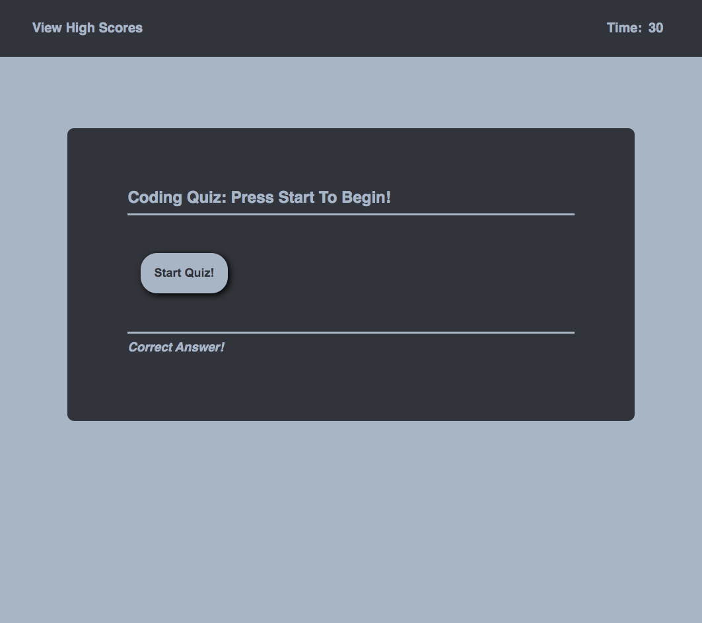
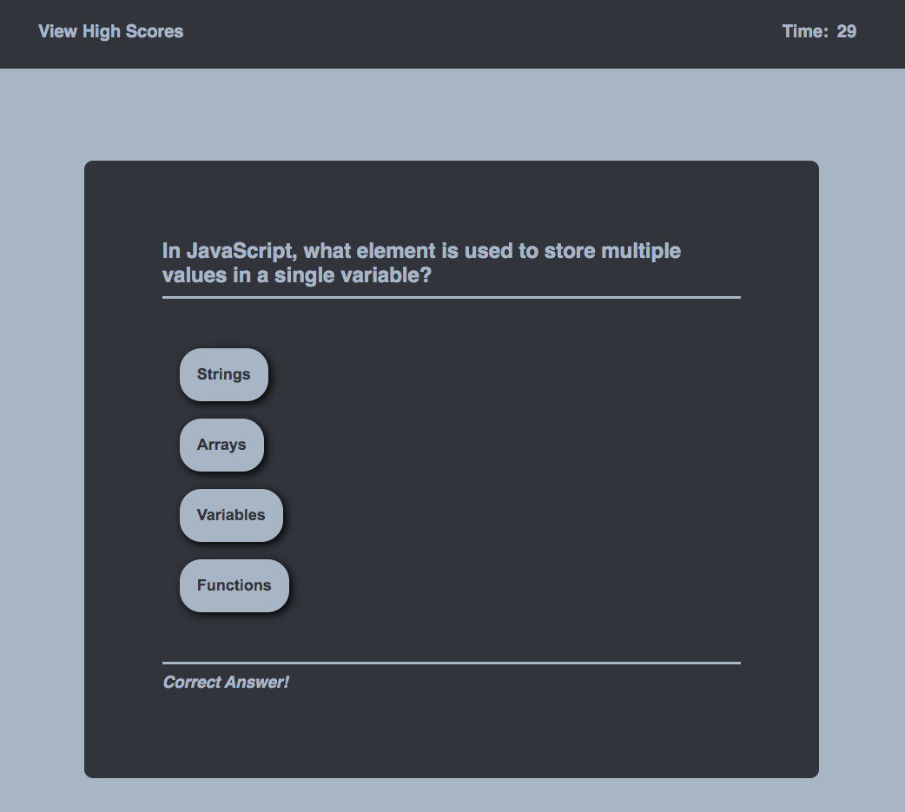
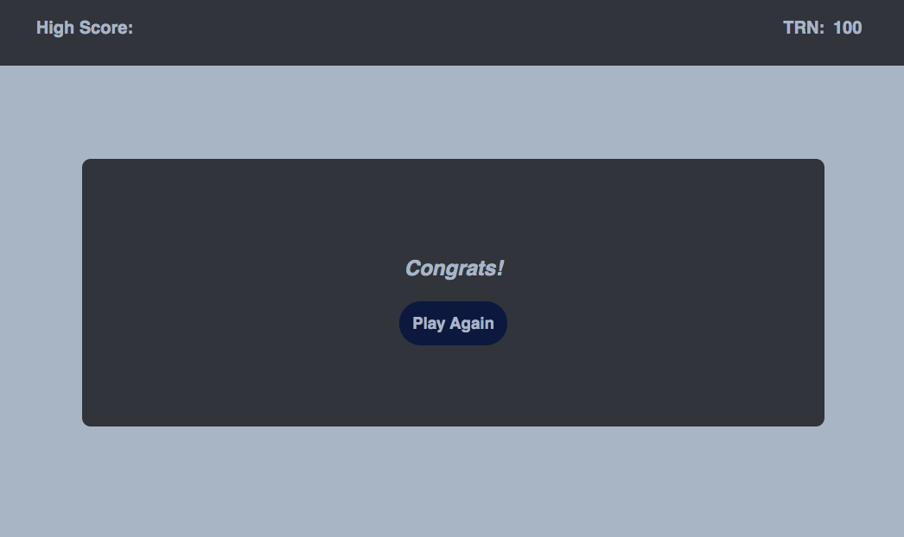

# JavaScript Code Quiz

## Purpose
A quiz application that tests a users knowledge of coding by asking a series of questions.
* The user has 30 seconds to complete the six questions
* Five seconds are dedeucted from the clock for each wrong answer
* The user gets 10 points for each correct answer
* At the end of the quiz the user can enter their initials next to their score to be saved in local storage and recalled on the high scores page

## Built With
* HTML
* CSS
* JavaScript

## Website
https://taylornyquist.github.io/code-quiz/

## Screen Shots

 
 
 

 ## Responsiveness
* Flex boxes used throughout

 ## Known Issues
* This application is not yet functioning correctly
* The high score function has yet to be built
* Their is currently only one question asked and the user is unable to submit an answer correctly

### Contribution
Made with ❤️ by Taylor Nyquist